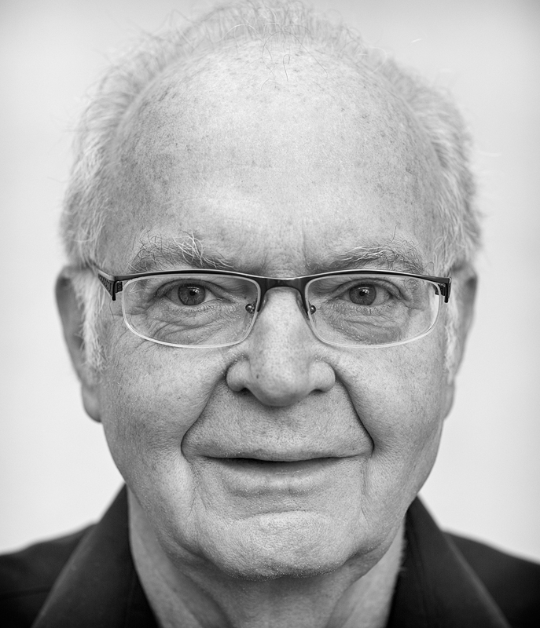
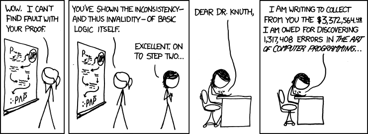

# Slides 1

Revisiting The Art of Computer Programming
==========================================

# Slides 2

Outline
-------
 - Short presentation/introduction to Knuth and his perception of programming

 - Neural plasticity
 - Brain Imaging studies
   - examples: taxi drivers and musicians, WHY NOT SOFTWARE DEVELOPERS
   - one study, Siegmund et. al. 2014, "reading code"

# Slides 3 

Donald Knuth (*10/01/1938)
--------------------------



 - Professor Emeritus at Stanford
 - Put the **Science** into Computer Science 
 - Father of $TeX$ 
 - Featured thrice in XKCD

# Slides 4




> Everyday life is like programming, I guess. If you love something you can put beauty into it. (Not verified, can't find reference)

More on the relationship between art and programming for Knuth

The Art of Computer Programming (TAOCP)
---------------------------------------

> The process of preparing programs for a digital computer is especially attractive, not only because it can be economically and scientifically rewarding, but also because it can be an **aesthetic experience much like composing poetry or music**. [emphasis added]
(The Art of Computer Programming (1968), Vol. 1, v.)

Creativity and programming 
--------------------------

Software development is inherently creative and is influenced by fields based in the aesthetics. Think about **Gang Of Four: Design Patterns: Elements of Reusable Object-Oriented Software**

> A design pattern is the re-usable form of a solution to a design problem. The idea was introduced by the architect Christopher Alexander and has been adapted for various other disciplines, most notably computer science.


> Science is knowledge which we under- stand so welt that we can teach it to a computer; and if we don't fully understand something, it is an art to deal with it.
(Knuth1974)

> The science without tile art is likely to be ineffective; the art without tile scierce is certain to be inaccurate."
(Knuth1974)

> When I speak about computer programming as an art, I am thinking primarily of it as an art form, in an aesthetic sense. The chief" goal of my work as educator and author is to help people learn how to write beau- tiJM programs.
(Knuth1974)

> Some programs are elegant, some are exquisite, some are sparkling. My claim is that it is possible to write grand programs, treble programs, truly magnificent ones!
(Knuth1974)
Neural plasticity
-----------------
What does it mean to program and how does it influence you. 

Brain studies show how your work changes your brain.

 - Recovery after impairment: Phineas Gage: Neuroscience's Most Famous Patient
 
 
 - London tazi drivers
 - Musicians vs. non-musicians
   - Practiced musical style shapes auditory skills
   - Tapping polyrhythms in music activates language areas

Ability for a region to be recruited in an otherwise unrelated task through continued adaptation and practice.

"Borrowing" processing power from a different region

> "superior visuospatial cognitive performance in action video game experts"
> "...larger gray matter volume in the right posterior parietal cortex in experts compared with non-experts"

1 study which looks at cognitive processing for software developers

 - Is something specific for this field.
 - computer programming is a study, a major part of this is learning to think in a specific way.

**Sub reddit discussing the Neuroscience of Programming:**
https://www.reddit.com/r/programming/comments/1ypetm/a_programmers_brain_on_code_the_neuroscience_of/

http://www.thebioneer.com/hackers-brain-the-psychology-of-programming/

> Besides a mathematical inclination, an exceptionally good mastery of one’s native tongue is the most vital asset of a competent programmer.
(Dijkstra)


> Experienced London taxi drivers have larger parahippocampal regions with size correlated with years of experience.
(Maguire2006)

> simple, focused, and energy-efficient action in the brain.


Neuroscience of programming (Siegmund et. al. 2014)
-------------------------------------------

functional Magnetic Reasonance Imaging (fMRI)
- measure brain activity as a function of the level of oxygenated blood flow 

Used fMRI to study how programmer's understand source code
 - simple tasks

```java
public static void main(String[] args)
{
	String word = "Hello";
    String result = new String();

    for (int j = word.length(); - 1; j >=0; j--)
        result = result + word.charAt(j);

    System.out.println(result);
}
//  Source code for one comprehension task with expected output ‘olleH‘.
```

> programming had less in common with mathematics and more in common with language.

Studies comparing subjects with and without a computer science background.


**Christopher Parnin: http://www.chrisparnin.me**

 - Can we finally provide a neurological basis for a programmer’s flow (being in the zone)?
 - What will studying an expert programmer’s brain reveal? How might years of programming experience manifest as changes in the brain?
 - Are there certain programming activities that should never be mixed
